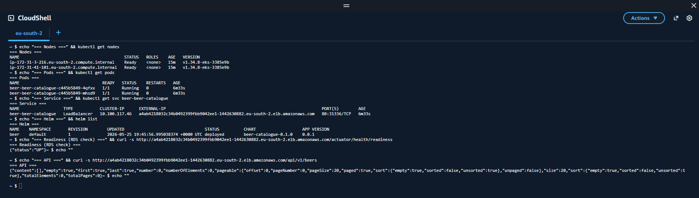
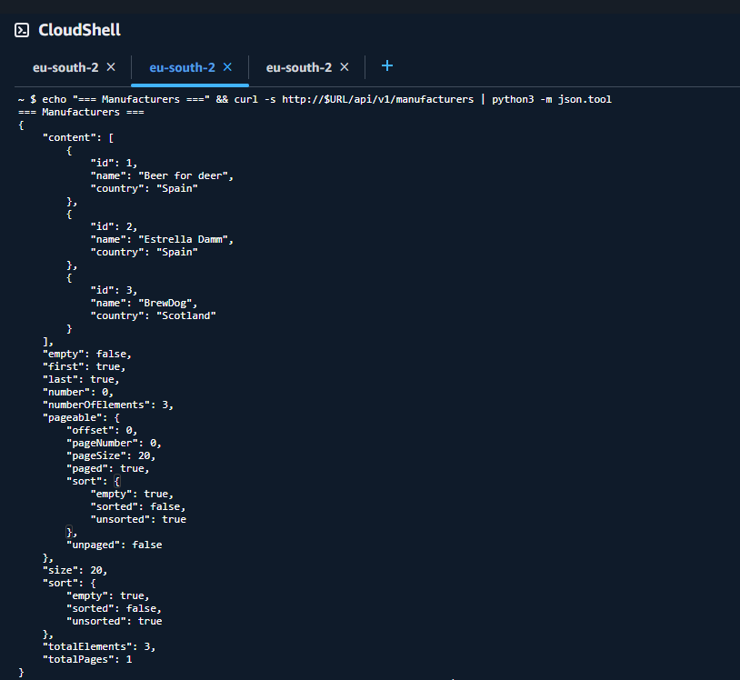
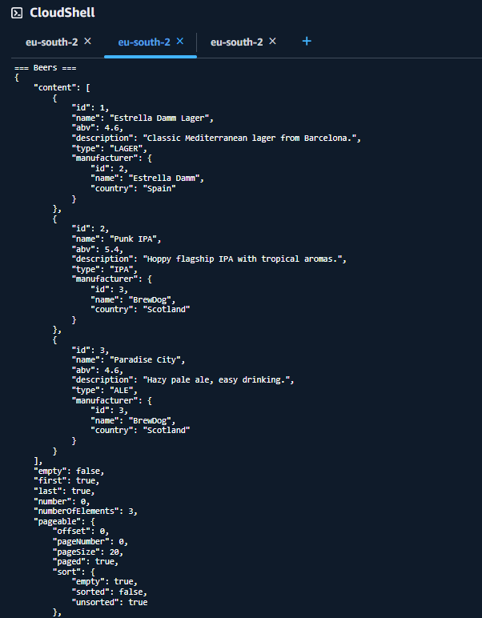
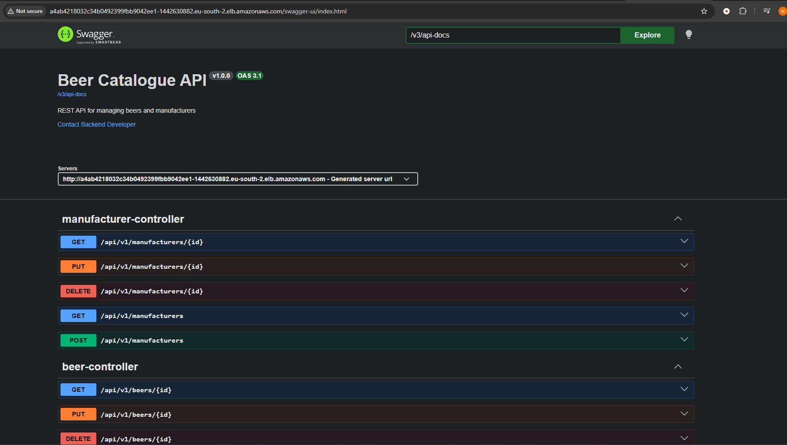
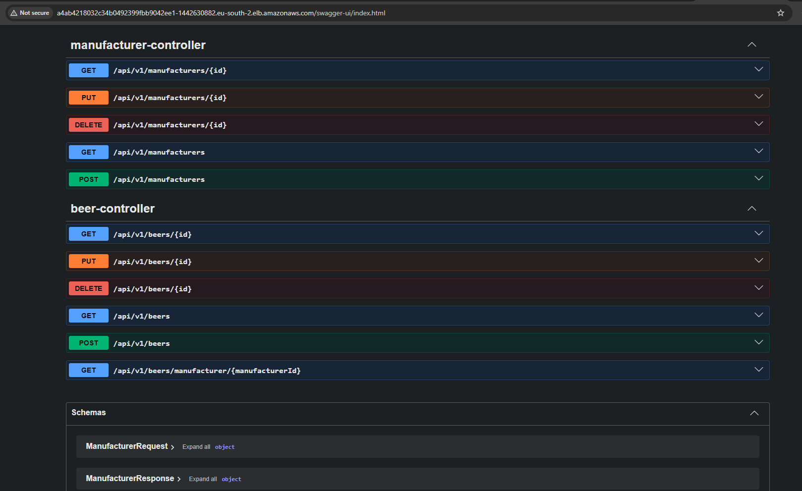
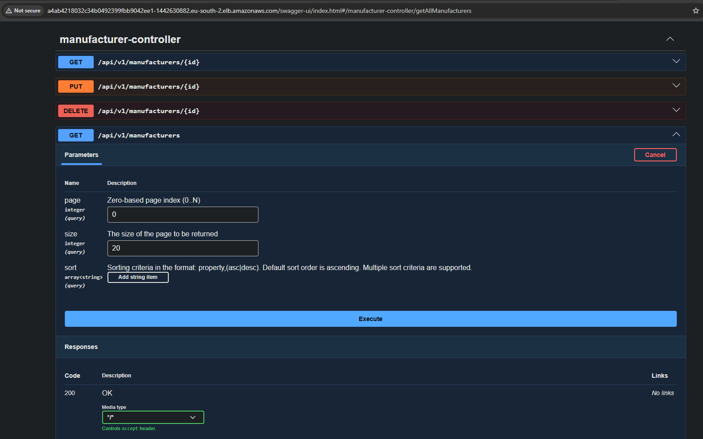

# Beer Catalogue API

REST API for managing a catalogue of beers and their manufacturers.

Built with **Java 21** and **Spring Boot 4**, backed by **PostgreSQL**, with a
production-style deployment to **AWS EKS** connecting to **AWS RDS**.

---

## Tech stack

- Java 21, Spring Boot 4 (Web MVC, Data JPA, Validation, Actuator)
- PostgreSQL + Flyway (versioned schema migrations)
- MapStruct (DTO mapping), Lombok
- SpringDoc OpenAPI (Swagger UI)
- Testcontainers + JUnit 5 (integration tests against a real PostgreSQL)
- Docker / Docker Compose, Helm, Kubernetes (EKS)
- SonarCloud + GitHub Actions (CI)

## Architecture

A pragmatic layered architecture:

```
controller/      REST endpoints (Beer, Manufacturer)
service/         business logic, transactions
repository/      Spring Data JPA + Specifications (dynamic search)
model/           JPA entities (Beer, Manufacturer, BeerType)
dto/             request/response DTOs (decoupled from entities)
mapper/          MapStruct entity <-> DTO mapping
exception/       GlobalExceptionHandler + typed errors
config/          OpenAPI configuration
```

Entities are never exposed directly: requests and responses use dedicated DTOs,
mapped via MapStruct. Errors are handled centrally in `GlobalExceptionHandler`
with proper HTTP status codes.

---

## Running locally

The whole stack (app + PostgreSQL) starts with Docker Compose:

```bash
docker compose up --build
```

The app is then available at `http://localhost:8080`.

- Swagger UI: `http://localhost:8080/swagger-ui/index.html`
- API base path: `/api/v1`

To run only the database and start the app from the IDE:

```bash
docker compose up postgres
```

### Tests

Integration tests run against a real PostgreSQL via Testcontainers (no H2), so
they exercise the same database engine as production:

```bash
./mvnw clean test
```

---

## API overview

Base path: `/api/v1`. Full interactive documentation at `/swagger-ui/index.html`.

| Method | Path | Description |
|--------|------|-------------|
| GET | `/api/v1/beers` | List beers (paged, sortable, searchable) |
| GET | `/api/v1/beers/{id}` | Get one beer |
| POST | `/api/v1/beers` | Create a beer |
| PUT | `/api/v1/beers/{id}` | Update a beer |
| DELETE | `/api/v1/beers/{id}` | Delete a beer |
| GET | `/api/v1/beers/manufacturer/{manufacturerId}` | Beers by manufacturer |
| GET | `/api/v1/manufacturers` | List manufacturers (paged, sortable) |
| GET | `/api/v1/manufacturers/{id}` | Get one manufacturer |
| POST | `/api/v1/manufacturers` | Create a manufacturer |
| PUT | `/api/v1/manufacturers/{id}` | Update a manufacturer |
| DELETE | `/api/v1/manufacturers/{id}` | Delete a manufacturer |

### Search & pagination (bonus)

Beer listing supports pagination, sorting and dynamic filtering (by name, type,
ABV, manufacturer) implemented with JPA Specifications:

```
GET /api/v1/beers?page=0&size=20&sort=name,asc&type=IPA
```

### API usage examples (curl)

Create a manufacturer:

```bash
curl -X POST http://localhost:8080/api/v1/manufacturers \
  -H "Content-Type: application/json" \
  -d '{"name":"BrewDog","country":"Scotland"}'
```

Create a beer (links to a manufacturer by id):

```bash
curl -X POST http://localhost:8080/api/v1/beers \
  -H "Content-Type: application/json" \
  -d '{"name":"Punk IPA","abv":5.4,"type":"IPA","description":"Hoppy flagship IPA.","manufacturerId":1}'
```

List beers:

```bash
curl http://localhost:8080/api/v1/beers
```

`type` accepts: `IPA`, `LAGER`, `STOUT`, `ALE`.

---

## Design decisions

**PostgreSQL everywhere, not H2.** The task allowed an in-memory database, but
the app uses real PostgreSQL in every environment (local, tests, production).
Testcontainers runs the same engine in tests, so behaviour that depends on the
database (constraints, types, SQL) is validated against the real thing rather
than an H2 approximation.

**Flyway with `ddl-auto=validate`.** The schema is owned by versioned Flyway
migrations, not by Hibernate. `ddl-auto=validate` makes the app fail fast if the
entities and the actual schema diverge, instead of silently altering tables.

**Layered, not over-engineered.** A clean controller/service/repository split
with DTOs and a mapper. No speculative abstractions (no triple DTO chains, no
use-case interfaces) that the problem does not need — kept deliberately
pragmatic, as the task asks.

**Secrets via environment variables.** No credentials are committed. The app
reads the DB password from `DB_PASSWORD`; Compose uses a local-only value, and
Kubernetes injects it from a Secret (see Cloud Deployment).

---

## Cloud Deployment (EKS + AWS RDS)

This covers the two cloud bonus tasks: a Kubernetes deployment (EKS) and a
PostgreSQL database on AWS RDS, with credentials kept out of the repository.
The app was deployed and verified on a real EKS cluster (screenshots in
`docs/`); the cluster was then torn down to avoid idle cloud costs. The full
Helm chart and reproduction steps are included so it can be redeployed.

### Architecture

```
        Internet
           |
   Service: LoadBalancer (NLB)   -> public URL
           |
   +-------------------+
   |   EKS  (VPC X)    |   2 app pods
   +-------------------+
           |  private endpoint, port 5432
   +-------------------+
   |  RDS PostgreSQL   |   private, same VPC X
   |  (not public)     |   SG allows 5432 from the EKS node SG only
   +-------------------+
```

The RDS instance is private (no public access). The pods reach it because EKS
and RDS share the same VPC, and the RDS Security Group allows inbound 5432 only
from the EKS cluster Security Group — the database is never exposed to the
internet.

### Design decisions and trade-offs

**LoadBalancer Service, not Ingress/ALB.** A `Service` of type `LoadBalancer`
gives a working public URL with no extra controllers. An ALB Ingress would add
TLS and host/path routing but needs the AWS Load Balancer Controller and IAM
wiring. For a single service, LoadBalancer is the simpler, correct choice.

**Helm chart, not raw manifests.** Image tag, RDS endpoint, replica count and
resources are parameterised in `values.yaml`. The same chart deploys to any
environment by swapping a values file.

**Secret handling.** The DB password is never in the repo. `values.yaml` holds
only the Secret *name* and *key*; the Deployment reads the value via
`secretKeyRef`, so it is never rendered into a manifest. The real Secret is
created out of band (`kubectl create secret`). In real production this would be
AWS Secrets Manager via External Secrets Operator / IRSA — the ServiceAccount
template carries the IRSA annotation as a comment to show the intended path.
base64 in a k8s Secret is encoding, not encryption, which is exactly why the
value stays out of the repo.

**Readiness tied to the database.** The readiness probe maps to
`/actuator/health/readiness`, whose group includes the `db` indicator. A pod is
Ready only after Flyway has migrated and the DB connection is live, so the
LoadBalancer never routes to a pod that cannot serve. Liveness is separate
(`livenessState` only) so a brief DB blip does not restart pods.

**Pod & image hardening.** The image runs as a non-root user (`USER 1000`),
aligned with `runAsNonRoot: true` / `runAsUser: 1000` in the chart. The
container uses a read-only root filesystem (with a writable `/tmp` emptyDir),
drops all Linux capabilities, and disables privilege escalation. CPU/memory
requests and limits are set. Graceful shutdown drains in-flight requests on
rollout.

### Container image

CI builds and pushes the image to GitHub Container Registry
(`.github/workflows/publish-image.yml`) on every push to `main`, tagged with
both the short Git SHA and `latest`, so a deploy can be pinned to an exact
commit. The image is public, so EKS pulls it without an imagePullSecret.

### How to deploy

Prerequisites: `aws` CLI, `eksctl`, `kubectl`, `helm`.

1. Create an EKS cluster in the same VPC as the RDS instance (so the private
   endpoint is reachable):

   ```bash
   eksctl create cluster -f cluster.yaml
   ```

2. Allow the cluster to reach the database — add an inbound rule to the RDS
   Security Group: PostgreSQL (5432) from the EKS cluster Security Group:

   ```bash
   CLUSTER_SG=$(aws eks describe-cluster --name beer-catalogue \
     --query "cluster.resourcesVpcConfig.clusterSecurityGroupId" --output text)
   aws ec2 authorize-security-group-ingress \
     --group-id <RDS_SG> --protocol tcp --port 5432 --source-group $CLUSTER_SG
   ```

3. Create the DB password Secret in the cluster:

   ```bash
   kubectl create secret generic beer-db-credentials \
     --from-literal=db-password='<rds-password>'
   ```

4. Deploy with Helm (fill the RDS endpoint and image repo in
   `helm/beer-catalogue/values-aws.yaml` first):

   ```bash
   helm install beer ./helm/beer-catalogue \
     -f ./helm/beer-catalogue/values-aws.yaml
   ```

5. Get the public URL:

   ```bash
   kubectl get svc beer-beer-catalogue
   # http://<EXTERNAL-IP>/swagger-ui/index.html
   ```

### Verification

The deployment was verified end to end on EKS.

**Cluster, pods, service and RDS connectivity.** Nodes Ready, two pods
`1/1 Running`, the LoadBalancer with its external address, the Helm release, and
`/actuator/health/readiness` returning `UP` — the readiness group includes the
`db` indicator, so `UP` proves the pods reached the private RDS instance.



**Real data through the API.** Manufacturers and beers were created and read
back via the deployed API. Each beer carries its nested manufacturer, showing
the entity relationship and a full write/read cycle against RDS.





**Swagger UI served from the deployed service.** The OpenAPI documentation is
live on the EKS endpoint; the Servers field shows the real LoadBalancer URL.



The full set of endpoints for both controllers, including the bonus
`GET /api/v1/beers/manufacturer/{manufacturerId}` and the request/response
schemas:



The beer and manufacturer listing endpoints expose `page`, `size` and `sort`
query parameters, confirming the Search & Pagination bonus is wired through to
the API surface:



### Teardown

The cluster and load balancer bill per hour, so they were removed after
verification:

```bash
helm uninstall beer
eksctl delete cluster --name beer-catalogue --region eu-south-2
```

---

## Static analysis — Sonar findings

The CI pipeline runs SonarCloud on every push and pull request. The Quality
Gate flagged 3 Security Hotspots, all the same rule (`githubactions:S7637`):
third-party GitHub Actions referenced by tag rather than by a full commit SHA.

A Hotspot is not a confirmed vulnerability — it is a security-sensitive line
that asks for a human review decision. All three were reviewed and marked
**Safe**: the flagged steps are the official, Docker-maintained actions
(`docker/login-action`, `docker/metadata-action`, `docker/build-push-action`)
pinned to a major version tag, from a trusted publisher. Pinning each action to
an immutable commit SHA is noted as a future hardening step.